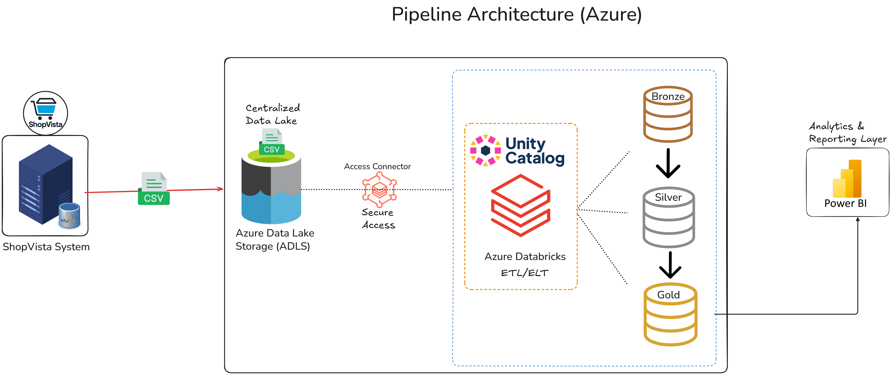

# 🛒 **Build E-commerce Data Pipeline using Spark & Databricks**

## 📖 **Project Overview**

ShopVista, a fast-growing e-commerce platform, struggled with fragmented datasets — orders, shipments, returns, and dimension data — spread across multiple sources. This led to **manual reporting**, **inconsistent insights**, and **delayed decision-making**.

The project builds a **Unified E-Commerce Data Lakehouse** using **Azure Databricks**, **ADLS Gen2**, and **Unity Catalog**, adopting the **Bronze → Silver → Gold** data architecture.

---

## 🎯 **Objectives**

- Automate ingestion of e-commerce data (orders, returns, shipments, dimensions)  
- Standardize and clean data for consistency across all layers  
- Build an analytics-ready data model integrated with **Power BI**  
- Enable scalable and auditable governance with **Unity Catalog**  

---

## 🧰 **Tools & Technologies**

| **Layer**       | **Tool / Service**                | **Purpose**                                      |
|-----------------|-----------------------------------|-------------------------------------------------|
| **Ingestion**   | Databricks Autoloader (Structured Streaming) | Incremental data loading from ADLS               |
| **Storage**     | Azure Data Lake Storage (ADLS Gen2) | Centralized data repository                      |
| **Processing**  | Azure Databricks (PySpark)    | ETL and transformation                           |
| **Governance**  | Unity Catalog                | Centralized access control and schema registry  |
| **Visualization** | Power BI                      | BI dashboards and reports                        |

---

## 🧱 **Data Architecture**


## 🗂 **Folder Structure** (ADLS Container: `ecomm-raw-data`)

The folder structure within the **ADLS container** is organized by entity (table).  
**Fact tables** contain a **`landing/`** subfolder for incoming data files.

```plaintext
ecomm-raw-data/
│
├── brands/                # Product brands data
├── category/              # Product category data
├── customers/             # Customer demographic data
├── date/                  # Date dimension table
├── products/              # Product details data
│
├── order_items/           # Sales transactions (item-level data)
│   └── landing/           # ← Daily data landing zone for new items
│
├── order_shipments/       # Shipping details for orders
│   └── landing/           # ← Monthly data landing zone for shipments
│
├── order_returns/         # Product return data
│   └── landing/           # ← Monthly data landing zone for returns
│
└── checkpoint/            # ← Used by Databricks Autoloader for streaming
```

---

### 📌 **Data Frequency**

- **order_items** → Daily data ingestion  
- **order_shipments** & **order_returns** → Monthly data ingestion  

---

## ⚙️ **ETL Workflow Overview**

| **Layer**   | **Description**                                                                 |
|-------------|---------------------------------------------------------------------------------|
| **Bronze**  | Raw ingestion using **Autoloader** into Delta tables with minimal transformation. |
| **Silver**  | Cleansed and schema-validated data. Reads directly from **Bronze** tables using **Unity Catalog**. |
| **Gold**    | Aggregated analytical tables for **Power BI** consumption.                       |

---
## 📊 **Power BI Reporting Layer**

Power BI connects to the **Gold layer** tables via **Databricks SQL Warehouse** for visual insights.


---

## ✅ **Outcomes**

- ⏱️ Automated daily & monthly ingestion using Autoloader 
- 🧩 Unified and governed schemas via Unity Catalog  
- ⚙️ Simplified data transformations (PySpark & Delta)  
- 📊 Real-time insights in Power BI 
- 🚀 Scalable architecture  

Copyright©️ Codebasics Inc. All rights reserved.
